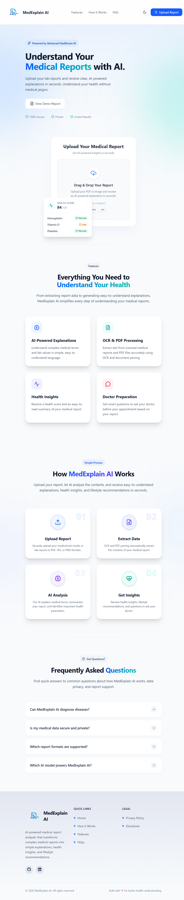
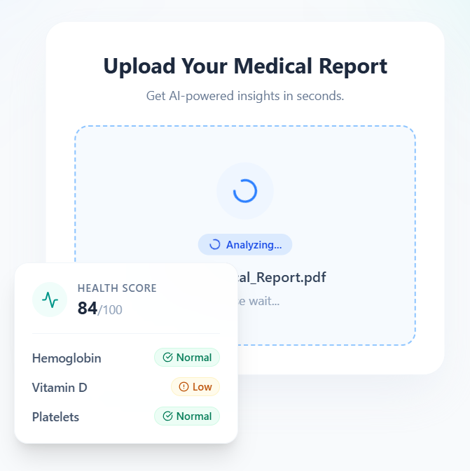
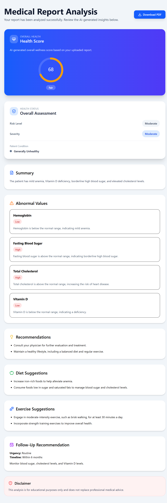
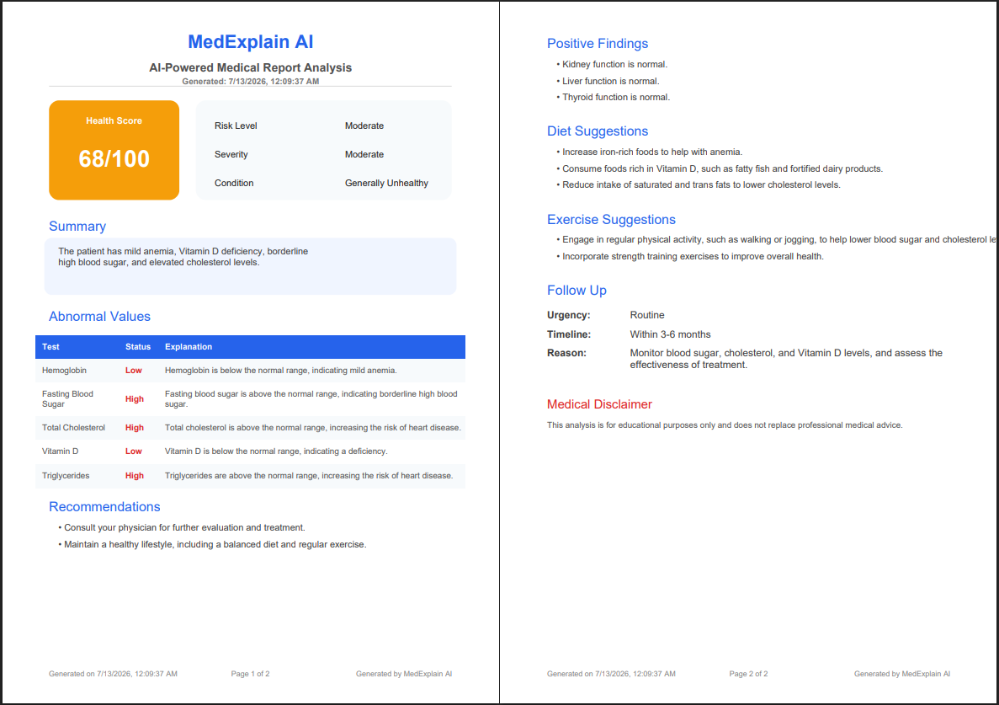

# 🩺 MedExplain AI

> An AI-powered medical report analyzer that converts complex medical reports into simple, understandable health insights.

🌐 **Live Demo:** https://med-explain-ai-ashy.vercel.app/

💻 **GitHub Repository:** https://github.com/BhavyaAgrawal14/MedExplain---AI

---

## 📖 Overview

MedExplain AI helps users understand medical reports by extracting text from PDFs and images, analyzing the report using an AI model, and presenting easy-to-understand health insights.

The application combines OCR, PDF parsing, and Large Language Models (LLMs) to simplify medical terminology and generate actionable recommendations.

---

## ✨ Features

- 📄 Upload medical reports in **PDF, PNG, JPG, or JPEG** format
- 🔍 OCR support for scanned reports
- 📑 Automatic PDF text extraction
- 🤖 AI-powered medical report analysis using **Groq Llama 3.3 70B**
- ❤️ AI-generated Health Score
- 🛡️ Risk Level & Severity Assessment
- 📋 Simplified Medical Summary
- ⚠️ Abnormal Test Value Detection with explanations
- ✅ Positive Health Findings
- 💡 Personalized Health Recommendations
- 🥗 Diet Suggestions
- 🏃 Exercise Suggestions
- 📅 Follow-up Recommendations
- 📥 Download AI analysis as a professionally formatted PDF
- 🌙 Light & Dark Mode support
- 📱 Fully responsive modern UI
- ⚖️ Privacy Policy & Medical Disclaimer page
- 🚫 Automatic detection of non-medical reports

---

## 🛠 Tech Stack

### Frontend

- React
- Vite
- Tailwind CSS
- React Router DOM
- Axios
- React Hot Toast
- Lucide React
- React Icons
- jsPDF
- jsPDF AutoTable

### Backend

- Node.js
- Express.js
- Multer
- pdf-parse
- Tesseract.js
- Groq SDK

### AI

- Groq LLM

### Deployment

- Vercel
- Render

---

## 📂 Folder Structure

```
MedExplain---AI
│
├── frontend
│   ├── src
│   │   ├── api
│   │   ├── components
│   │   ├── pages
│   │   └── assets
│
├── backend
│   ├── routes
│   ├── services
│   ├── parser
│   ├── uploads
│   └── server.js
```

---

## 📸 Screenshots

### 🏠 Home Page



---

### 📤 Upload & Analysis



---

### 📊 Dashboard



---

### 📄 Downloadable PDF Report



---

### 🌙 Dark Mode


---

### ⚖️ Privacy Policy & Medical Disclaimer


---

## 🚀 Installation

### Clone Repository

```bash
git clone https://github.com/BhavyaAgrawal14/MedExplain---AI.git

cd MedExplain---AI
```

---

### Backend

```bash
cd backend

npm install
```

Create a `.env` file:

```env
PORT=5000

GROQ_API_KEY=your_api_key_here
```

Start backend

```bash
npm run dev
```

---

### Frontend

```bash
cd frontend

npm install
```

Create `.env`

```env
VITE_API_URL=http://localhost:5000/api
```

Start frontend

```bash
npm run dev
```

---

## 🌍 Live Demo

**Frontend:**  
https://med-explain-ai-ashy.vercel.app/

**Backend API:**  
https://medexplain-ai-backend.onrender.com

---

## 🔮 Future Improvements

- 🔐 User Authentication
- 📂 Medical Report History
- 💬 AI Chat Assistant ("Ask AI About This Report")
- 🌍 Multi-language Report Explanations
- 📈 Health Trend Tracking
- 👨‍⚕️ Doctor Question Generator
- 📤 Share Reports via Email
- 📱 Progressive Web App (PWA) Support

---

## ⚠️ Disclaimer

This project is for educational purposes only.

The AI-generated analysis should **not** be considered medical advice. Always consult a qualified healthcare professional.

---

## 🧠 How It Works

1. Upload a medical report (PDF or image).
2. OCR and PDF parsing extract the report contents.
3. Groq Llama 3.3 70B analyzes the extracted medical data.
4. MedExplain AI generates:
   - Health Score
   - Risk Assessment
   - Simplified Summary
   - Abnormal Findings
   - Recommendations
   - Diet & Exercise Suggestions
   - Follow-up Advice
5. Download the complete AI-generated report as a PDF.

---

## 👨‍💻 Author

**Bhavya Agrawal**

- GitHub: https://github.com/BhavyaAgrawal14
- LinkedIn: https://www.linkedin.com/in/bhavya-agrawal-460621341/

---

⭐ If you like this project, consider giving it a star!
